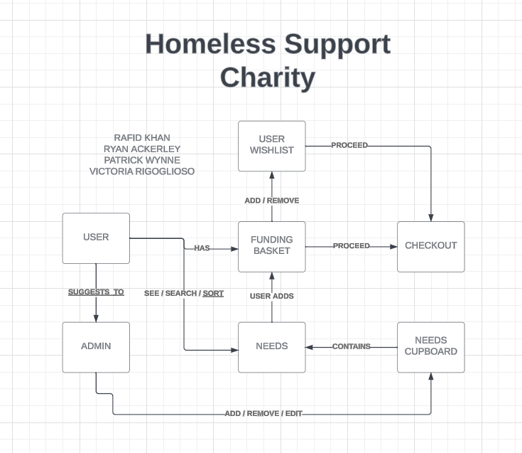
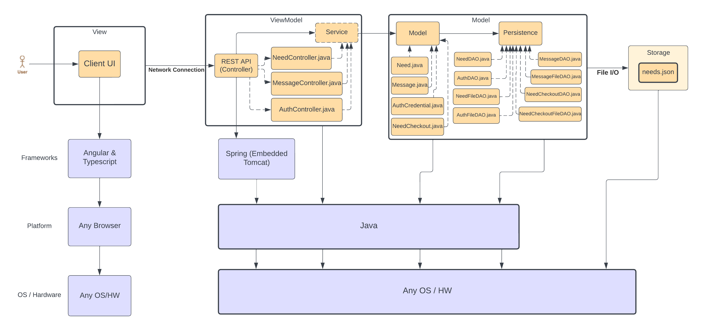

# PROJECT Design Documentation

## Team Information
* Team name: Team 1
* Team members
  * Rafid Khan
  * Ryan Ackerley
  * Patrick Wynne
  * Victoria Rigoglioso

## Executive Summary

This web application allows users to contribute to a homeless charity. The application is managed
by the administrator who can manage the current needs. The user can contribute to the needs they'd like to. 

### Purpose

This project is an application which simulates a fundraiser. There is a collection of several 'needs' (organized by the administrator) that require funds to advance by users. There are two user groups, the helpers, which select the needs that they'd like to contribute to, and do so and the administrators, who manage the fundraiser, and the specfic needs in the agenda. 

### Glossary and Acronyms

| Term | Definition |
|------|------------|
| SPA | Single Page |
| Needs | Elements of the fundraiser |
| Helper | Users who are looking to contribute to the fundraiser |
| Admin | Manager of the fundraiser |
| Data Persistance | System has data integrity, changes are saved | 
| Minimal Authentication | Security of user login and privileges |  

## Requirements

In a simplified authentication system for a Helper/U-fund Manager application, users log in with just a username, where logging in as "admin" identifies a user as the U-fund Manager. Helpers can view, search, add, or remove needs from their funding basket and checkout to fund chosen needs. U-fund Managers have the authority to add, remove, and edit needs in the system but cannot view Helpers' funding baskets. All data is persisted to files, ensuring that changes are reflected for the next user session. Users will also have the ability to submit suggestion messages to the U-fund Manager. 

### Definition of MVP

The MVP for the U-Fund project includes minimal authentication for user login, helper functionality enabling viewing, searching, and funding of needs, alongside needs management capabilities for U-Fund managers, all ensuring data persistence across sessions.

### MVP Features
>  _**[Sprint 4]** Provide a list of top-level Epics and/or Stories of the MVP._

### Enhancements
> _**[Sprint 4]** Describe what enhancements you have implemented for the project._

## Application Domain

This section describes the application domain.

In this domain model, the relationships between the User / Helper and the Needs and Funding Basket are clearly defined. Similarly, the relationships with the U-Fund administrator are defined as well. It is clear that the administrator is the one in charge of of managing the cupboard, which contains the needs that the User / Helper can add to their funding basket, wishlist, or checkout. 

## Architecture and Design

This section describes the application architecture.

### Summary

The following Tiers/Layers model shows a high-level view of the webapp's architecture. 

The web application, is built using the Model–View–ViewModel (MVVM) architecture pattern. 

The Model stores the application data objects including any functionality to provide persistance. 

The View is the client-side SPA built with Angular utilizing HTML, CSS and TypeScript. The ViewModel provides RESTful APIs to the client (View) as well as any logic required to manipulate the data objects from the Model.

Both the ViewModel and Model are built using Java and Spring Framework. Details of the components within these tiers are supplied below.

### Overview of User Interface

This section describes the web interface flow; this is how the user views and interacts with the web application.

> _Provide a summary of the application's user interface.  Describe, from the user's perspective, the flow of the pages in the web application._

### View Tier
> _**[Sprint 4]** Provide a summary of the View Tier UI of your architecture.
> Describe the types of components in the tier and describe their
> responsibilities.  This should be a narrative description, i.e. it has
> a flow or "story line" that the reader can follow._

> _**[Sprint 4]** You must  provide at least **2 sequence diagrams** as is relevant to a particular aspects 
> of the design that you are describing.  (**For example**, in a shopping experience application you might create a 
> sequence diagram of a customer searching for an item and adding to their cart.)
> As these can span multiple tiers, be sure to include an relevant HTTP requests from the client-side to the server-side 
> to help illustrate the end-to-end flow._

> _**[Sprint 4]** To adequately show your system, you will need to present the **class diagrams** where relevant in your design. Some additional tips:_
 >* _Class diagrams only apply to the **ViewModel** and **Model** Tier_
>* _A single class diagram of the entire system will not be effective. You may start with one, but will be need to break it down into smaller sections to account for requirements of each of the Tier static models below._
 >* _Correct labeling of relationships with proper notation for the relationship type, multiplicities, and navigation information will be important._
 >* _Include other details such as attributes and method signatures that you think are needed to support the level of detail in your discussion._

### ViewModel Tier
NeedController.java -- This class handles the REST API requests for the Need resource

> _**[Sprint 4]** Provide a summary of this tier of your architecture. This
> section will follow the same instructions that are given for the View
> Tier above._

> _At appropriate places as part of this narrative provide **one** or more updated and **properly labeled**
> static models (UML class diagrams) with some details such as critical attributes and methods._

### Model Tier
Need.java -- Represents a Need entity 

AuthCredentials.java -- Represents Authorization Credentials 

The need class uses the information given by the AuthCredentials to ensure that 'need operations',
(add/remove/etc.) can only be performed by the intended user. This management is critical to ensure that the application has the minimal authentication features outlined in the Minimal Viable Product Vision. 

## OO Design Principles

Controller (GRASP): A design pattern that assigns the responsibility of dealing with system events to a non-UI class that makes decisions and controls the flow of the application. It acts as an intermediary between the UI and the business logic, handling user input and invoking responses in the system.

Single Responsibility Principle (SOLID): A principle that states a class should have only one reason to change, meaning it should have only one job or responsibility. This promotes a cleaner, more modular design by separating concerns within a software system.

Information Expert (SOLID): In the U-Fund project, the Information Expert principle is applied by assigning tasks to classes that hold the relevant data. For instance, the NeedsCupboard manages needs, and a UserManager handles user authentication. To further enhance adherence to this principle we can centralize all data-related operations within the owning class. For example, a SearchService in the NeedsCupboard should manage search operations. Use a FundingBasket class to manage all actions on the funding basket, ensuring changes are made through its methods for better data encapsulation and responsibility localization.

Law of Demeter (SOLID): the Law of Demeter is applied to limit direct interactions between system
components. For example, a Helper should use methods on the NeedsCupboard to interact with needs
instead of directly accessing them. To further enhance adherence to this principle we can encourage using
class methods for operations, like a Helper using FundingBasket methods to add needs, keeping the
system's parts decoupled. Implement facade or service layers, such as a NeedManagementService, to
mediate interactions between the UI and data models, reducing direct component coupling

> _**[Sprint 3 & 4]** OO Design Principles should span across **all tiers.**_

## Static Code Analysis/Future Design Improvements
> _**[Sprint 4]** With the results from the Static Code Analysis exercise, 
> **Identify 3-4** areas within your code that have been flagged by the Static Code 
> Analysis Tool (SonarQube) and provide your analysis and recommendations.  
> Include any relevant screenshot(s) with each area._

> _**[Sprint 4]** Discuss **future** refactoring and other design improvements your team would explore if the team had additional time._

## Testing

### Acceptance Testing
All of our user stories have passed acceptance criteria. 

### Unit Testing and Code Coverage
> _**[Sprint 4]** Discuss your unit testing strategy. Report on the code coverage
> achieved from unit testing of the code base. Discuss the team's
> coverage targets, why you selected those values, and how well your
> code coverage met your targets._

These are some of our code coverage test results. As shown, our code is generally well-tested. These test results gave us insights into how to improve our test coverage. 

Both the AuthFileDAO and the NeedFileDAO have missed instructions and missed branches. In the AuthFileDAO, the getAuthCredentials method has two branches that have not been tested: if the authCredentials contains the given username key and if it does not. We must add two tests: one that covers if the authCredentials contains the key and one that covers the case where it does not.

The NeedFileDAO’s code coverage needs to be improved by implementing a test for the successful updating of a Need. So far, it only covers handling the exception in which the user tries to update a Need that is not found. There must be a test covering the successful updating of a Need.

## Ongoing Rationale
(2024/02/21): Sprint #1 -- Created the necessary utilities needed to perform cURL operations on the Need entity. Includes functionalities such as creating / deleting need, retrieving specific need, searching need by partial name, updating needs, and listing all needs.

(2024/03/22): Sprint #2 -- Implemented all functionalities for minimal authentication so users are limited to performing actions according to their privileges. Introduced testing, and code coverage testing to ensure that our code is robust and functional. Also implemented functionalities related to the 'Checkout' of our application, such that users can fund a specific need, and ensure consistency with the cupboard.  
